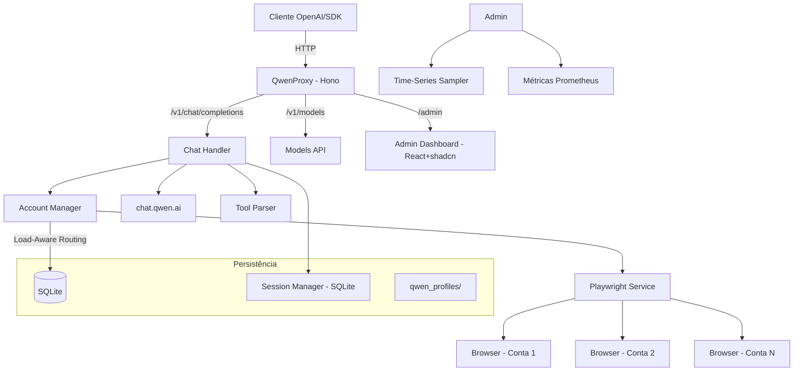

<p align="center">
  
</p>

Proxy API local compatível com OpenAI que roteia requisições para os modelos do **Qwen (chat.qwen.ai)** via automação de navegador com Playwright. Suporte a múltiplas contas com **roteamento por carga (load-aware)**, **dashboard de administração** (React + shadcn/ui), **API keys multiusuário** com cotas, sessões híbridas persistentes, execução de ferramentas, modo de pensamento (reasoning) e armazenamento em SQLite.

[](https://github.com/sanek88lbl/qwenproxy/actions/workflows/ci.yml)
[](https://www.typescriptlang.org/)
[](https://hono.dev/)
[](https://playwright.dev/)
[](LICENSE)
<a href="https://www.buymeacoffee.com/pedrofariasx" target="_blank"></a>

---

## Features

- **OpenAI API Compatible** — Interface compatível com `/v1/chat/completions`, `/v1/models` e `/v1/upload`.
- **Multi-Account** — Múltiplas contas Qwen com **roteamento por carga** (load-aware scheduling), cooldown automático e warm pool de chats.
- **Admin Dashboard** — Painel de administração completo em `/admin` (React + shadcn/ui) com gráficos em tempo real via SSE.
- **Multi-User** — API keys por usuário com rate limit (RPM) e teto de concorrência.
- **Hybrid Sessions** — Sessões de conversa persistentes (SQLite) com envio econômico, verificação de histórico e guard contra respostas degeneradas ("Yes").
- **Guest Mode** — Modo convidado sem necessidade de login, usando a API pública do Qwen.
- **SQLite Storage** — Contas, usuários e sessões em banco SQLite (WAL mode).
- **Reasoning Support** — Controle do modo de pensamento (thinking) dos modelos Qwen via `reasoning_effort` no body do `/v1/chat/completions` (valores: `none`, `low`, `medium`, `high`, `xhigh`, `max`). `none` desativa o thinking; qualquer outro valor válido ativa. Os sufixos `-thinking`/`-no-thinking` foram removidos do catálogo do `/v1/models`, mas continuam aceitos nas requisições como fallback legado quando `reasoning_effort` não é enviado — que tem precedência sobre o sufixo.
- **Multimodal Upload** — Envio de imagens, vídeos, áudios e documentos via `/v1/upload` com integração ao OSS do Qwen (texto embutido no prompt).
- **Tool Execution** — Sistema de execução de ferramentas locais integrado ao fluxo do chat.
- **Session Persistence** — Perfil de navegador persistente por conta em `qwen_profiles/`.
- **Auto-Login** — Login automático via credenciais com recuperação de sessão.
- **Browser Selection** — Escolha entre Chromium, Chrome, Firefox, Edge ou WebKit.
- **Monitoring** — Health check, métricas Prometheus, watchdog e séries temporais (amostras a cada 5s, janela de 20min).
- **CLI Binary** — Instale globalmente via npm e use o comando `qwenproxy` diretamente.
- **Docker Ready** — Deploy para VPS com Docker, volumes persistentes e graceful shutdown.

---

## Arquitetura



---

## Pré-requisitos

| Dependência       | Versão Mínima | Instalação                                         |
| ----------------- | ------------- | -------------------------------------------------- |
| Node.js           | >=22.13.0     | [nvm](https://github.com/nvm-sh/nvm)               |
| npm               | v9.x          | Incluído com Node.js                               |
| Playwright        | -             | `npx playwright install`                           |
| Docker (opcional) | v24.x         | [Docker Docs](https://docs.docker.com/get-docker/) |

---

## Установка форка

### Из исходников

```bash
git clone https://github.com/sanek88lbl/qwenproxy.git
cd qwenproxy
npm ci
npm --prefix web ci
npx playwright install
npm run build:all
npm start
```

Для глобальной установки можно собрать локальный tarball командой `npm pack` и установить полученный файл через `npm install -g /path/to/package.tgz`. Команда `qwenproxy` запускает собранный сервер. Отдельного опубликованного npm-пакета форка пока нет; имя в package.json сохранено от исходного проекта.

### Docker

```bash
docker compose up -d --build
```

Compose собирает исходники текущего checkout и сохраняет БД и профили в отдельных томах. Оригинальный проект: https://github.com/pedrofariasx/qwenproxy.

---

## Configuração

Crie o arquivo `.env` na raiz do projeto (veja `.env.example`):

```env
# Porta do servidor (default: 3000)
PORT=3000

# Host do servidor (default: 0.0.0.0)
HOST=0.0.0.0

# Chave de API para proteger os endpoints (opcional)
API_KEY=sua-chave-secreta-aqui

# Credenciais Qwen para login automático (modo single-account)
QWEN_EMAIL=seu-email@exemplo.com
QWEN_PASSWORD=sua-senha-aqui

# Modo convidado - sem login, usa API pública (default: false)
QWEN_GUEST_MODE_ONLY=false

# Navegador (chromium, firefox, chrome, edge, webkit)
BROWSER=chromium

# Executar navegador sem interface gráfica (default: true)
HEADLESS=true

# Timeouts (milissegundos)
NAVIGATION_TIMEOUT=90000
PAGE_TIMEOUT=60000
HTTP_TIMEOUT=45000
HEADERS_TIMEOUT=90000
CHAT_TIMEOUT=120000
STREAM_IDLE_TIMEOUT=180000
```

Anexos por URL aceitam somente HTTP(S) para endereços públicos. Cada resposta DNS e redirecionamento é validado; a conexão usa os endereços aprovados. O download usa TLS estrito e conexão direta, sem encaminhar cookies, headers do Qwen ou variáveis de proxy do processo. Endereços internos, de loopback e de transição IPv6 são recusados.

`ATTACHMENT_DOWNLOAD_MAX_BYTES` limita cada download e a soma dos bytes decodificados dos anexos do pedido (padrão: 20971520, 20 MiB). O limite também cobre o corpo comprimido de cada download. `ATTACHMENT_MAX_FILES` limita o total de arquivos a 16; `ATTACHMENT_DOWNLOAD_MAX_REDIRECTS` permite até 5 redirecionamentos por arquivo, e `ATTACHMENT_DOWNLOAD_TIMEOUT_MS` limita cada download completo a 45000 ms, incluindo DNS, redirecionamentos e leitura do corpo. Erros de download são devolvidos ao cliente; o anexo não é descartado silenciosamente. Os limites de bytes e quantidade também se aplicam a anexos base64.

---

## Gerenciamento de Contas

As contas são armazenadas em SQLite (`data/qwenproxy.db`). Use o CLI interativo para gerenciar:

```bash
# Abrir o gerenciador de contas
npm run login

# Com navegador específico
npm run login:firefox
npm run login:chrome
npm run login:edge
```

O menu interativo permite:

- **[A]** Adicionar conta com credenciais (email + senha)
- **[M]** Adicionar conta via login manual no navegador
- **[R]** Remover uma conta
- **[L]** Login em todas as contas (inicializar sessões)

> Na primeira execução, se existir um `accounts.json` antigo, as contas serão migradas automaticamente para SQLite.

---

## Uso

### Iniciar o servidor

```bash
npm start                  # Chromium (padrão)
npm run start:chrome       # Google Chrome
npm run start:firefox      # Firefox
npm run start:edge         # Microsoft Edge
```

O servidor inicia em `http://localhost:3000` com as seguintes rotas:

| Rota                        | Método | Descrição                                                            |
| --------------------------- | ------ | -------------------------------------------------------------------- |
| `/v1/chat/completions`      | POST   | Chat completions (streaming + non-streaming)                         |
| `/v1/chat/completions/stop` | POST   | Abortar uma geração ativa                                            |
| `/v1/models`                | GET    | Listar modelos disponíveis                                           |
| `/v1/models/:model`         | GET    | Informações de um modelo específico                                  |
| `/v1/upload`                | POST   | Upload de arquivos multimodais (imagens, vídeos, áudios, documentos) |
| `/admin`                    | GET    | Dashboard de administração (React + shadcn/ui)                       |
| `/health`                   | GET    | Health check com status do sistema                                   |
| `/metrics`                  | GET    | Métricas no formato Prometheus                                       |

---

## Exemplos de Integração

### OpenAI SDK (Node.js)

```typescript
import OpenAI from "openai";

const openai = new OpenAI({
  baseURL: "http://localhost:3000/v1",
  apiKey: process.env.API_KEY || "sk-no-key-required",
});

const completion = await openai.chat.completions.create({
  model: "qwen-plus",
  messages: [{ role: "user", content: "Explique como funciona o Playwright." }],
});

console.log(completion.choices[0].message.content);
```

### cURL

```bash
curl http://localhost:3000/v1/chat/completions \
  -H "Content-Type: application/json" \
  -H "Authorization: Bearer sua-chave" \
  -d '{
    "model": "qwen-plus",
    "messages": [{"role": "user", "content": "Hello!"}],
    "reasoning_effort": "high",
    "stream": true
  }'
```

## Sessões híbridas (economia de contexto) e upload de arquivos .txt

Para conversas longas o proxy usa a **estrutura híbrida**: a primeira mensagem de
uma conversa envia o histórico completo (bootstrap). Depois de confirmar o prefixo do histórico do cliente, apenas as mensagens novas são enviadas ao mesmo `chat_id`, com `parent_id`. Instruções inalteradas não são reenviadas.

Para ativar, informe a mesma chave de sessão em todas as mensagens da conversa,
usando o campo OpenAI `user` (ou o header `x-qwen-session`):

```typescript
const completion = await openai.chat.completions.create({
  model: "qwen-plus",
  user: "minha-conversa-123",
  messages: [
    /* histórico completo da conversa */
  ],
});

// A resposta expõe `session_id` (o chat_id no Qwen). Você pode continuar a
// conversa passando esse valor de volta no campo `user`.
console.log(completion.session_id);
```

- **Turno 1** de uma sessão: `parent_id = null`, histórico completo enviado.
- **Turnos seguintes**: o cliente envia o histórico completo; após conferir o prefixo confirmado, o proxy encaminha somente o sufixo novo com o parent confirmado. Edições do prefixo exigem novo bootstrap.
- Sem chave de sessão, o histórico completo é enviado.
- Ferramentas permitem reuse quando o prefixo confere; entrada multimodal usa bootstrap.

**Arquivos de texto (.txt/.md/.csv/...)** enviados pelo usuário ou prompts
grandes são **embutidos no texto da mensagem** (para o modelo sempre ver o
conteúdo) com uma diretiva explícita de resposta completa. Respostas degeneradas
(apenas "Yes", "Ok", "Sim") são detectadas e, no modo não-streaming, a requisição
é refeita uma vez com uma diretiva corretiva — nunca são entregues como resposta
final.

Configuração (`.env`):

```
HYBRID_SESSIONS_ENABLED=true
HYBRID_SESSION_VERIFY=true   # verifica histórico no servidor antes de reusar; divergência → re-bootstrap
HYBRID_SESSION_TTL_MS=86400000
```

O bootstrap completo e o histórico reduzido usam a mesma serialização de papéis, nomes, IDs de chamadas e resultados de ferramentas. Strings de argumentos JSON válidas mantêm sua representação original, inclusive literais inteiros grandes; strings de argumentos incompletas são preservadas como texto. Instruções system/developer são incluídas uma vez e o orçamento considera o contrato de ferramentas. A versão reduzida do bootstrap só é preparada quando esse caminho é usado; o reuso econômico não é recusado pelo tamanho de um bootstrap que não será enviado. Um fallback para bootstrap passa pela mesma validação antes da completion.

Ao reduzir o contexto, grupos de chamadas/resultados e mensagens com mídia são mantidos inteiros ou omitidos inteiros. Somente a mídia retida é enviada para upload. Se o grupo atual não cabe, a API retorna 400 (`ContextWindowExceeded`) antes de criar uma completion, em vez de enviar um resultado parcial sem sua chamada. Memórias resumidas de ferramentas anteriores são limitadas pelo orçamento disponível; o limite de texto usa a estimativa do tokenizer configurado, não uma medição exata do tokenizer remoto do Qwen.

## Dashboard de administração

Acesse `http://localhost:3000/admin` para gerenciar o projeto em uma única tela
— frontend **React 19 + shadcn/ui** (pasta `web/`, Vite + Tailwind v4), servido
diretamente pelo proxy.

O que você encontra:

- **Visão geral** — KPIs (requisições, erros, latência, streams, sessões e
  **memória RSS%** do sistema) + **gráficos em tempo real** por tipo de dado:
  requisições/min e erros em **barras**, latência em **linha**, streams/memória/
  sessões em **área**. Os dados chegam por **Server-Sent Events** (uma única
  conexão, push a cada 3s), com amostras de 5s e janela de 20min; se o stream
  cair, há fallback automático para polling de 4s.
- **Contas** — adicionar/remover contas Qwen, limpar cooldown, forçar refresh
  de headers e ver a carga atual de cada conta (barras de progresso).
- **API Keys** — multiusuário: criar/editar/remover usuários, regenerar chaves e
  ajustar **RPM** e **concorrência** por usuário.
- **Configuração** — editar as variáveis essenciais do `.env` (com validação e
  allowlist), baixar métricas em Prometheus e reiniciar o servidor.
- **Métricas** — saída Prometheus completa de `/metrics`, agrupada por métrica,
  com filtro de busca e botão de copiar.

<p align="center">
  
</p>

**Build do frontend** (necessário quando a pasta `web/dist` não existir; o servidor
usa um painel inline simples como fallback):

```bash
npm --prefix web install
npm --prefix web run build   # ou a partir da raiz: npm run build:admin
```

Autenticação: defina `ADMIN_PASSWORD` no `.env` (ou deixe em branco para usar a
`API_KEY`). A sessão usa cookie HttpOnly assinado (7 dias).

```
ADMIN_PASSWORD=
```

---

## Multi-Usuário (API Keys com cotas)

Quando exposto para vários usuários, cada um recebe a própria API key com
**rate limit** (requisições por minuto) e **teto de concorrência** (streams
simultâneos). Chaves de usuários SQLite podem ser criadas pela dashboard em
`/admin`. Chaves de ambiente são configuradas separadamente em `USER_API_KEYS`:

```env
USER_RATE_LIMIT_RPM=120        # padrão por usuário
USER_MAX_CONCURRENCY=8         # máximo de streams simultâneos por usuário
USER_API_KEYS=sk-key-1:usuario1,sk-key-2:usuario2
```

Os clientes autenticam com `Authorization: Bearer <chave>`. A `API_KEY` global
continua valendo como proprietário global separado. Um usuário que
estoura o limite recebe `429` com a mensagem correspondente.

Qualquer chave global, de ambiente ou de usuário SQLite configurada ativa a autenticação dos endpoints `/v1/*`. Uma chave válida de usuário funciona sem `API_KEY` global; uma chave ausente, inválida ou com esquema diferente de Bearer retorna 401. `AUTH_REQUIRED=true` sem nenhuma fonte de chaves retorna 500 por erro de configuração. Somente a ausência de todas as fontes com `AUTH_REQUIRED=false` permite o proprietário anônimo; um Authorization inválido não é ignorado nesse modo.

No modo anônimo, todos os clientes compartilham o mesmo proprietário; a separação entre usuários exige chaves distintas. Várias chaves de ambiente com a mesma etiqueta representam o mesmo proprietário e compartilham suas conversas e cotas. Se a mesma credencial estiver configurada em várias fontes, a precedência é `API_KEY` global, `USER_API_KEYS` e depois SQLite.

`user`, `x-qwen-session` e `x-session-id` são identificadores de conversa, não credenciais. Conversas, aliases de chat, referências de ferramentas e Stop respeitam o proprietário autenticado. O token de parada sozinho não autoriza outro proprietário. Proprietários globais, de ambiente, SQLite e anônimos têm espaços separados, mesmo que suas etiquetas coincidam. Alterar a API key de um usuário SQLite mantém sua identidade; para chaves de ambiente, mantenha a mesma etiqueta explícita ao trocar a chave. Sem etiqueta, a identidade depende do hash da chave. Chaves de ambiente não são gravadas no SQLite; registros de usuários existentes são preservados como fonte independente e exigem revogação própria.

A migração adiciona `sessions.owner` nullable e preserva as sessões antigas, incluindo seus headers e parents. Registros sem proprietário não são entregues ao primeiro cliente que apresente sua chave ou alias, nem expiram automaticamente durante essa migração. Seu acesso exige um mapeamento administrativo explícito, preparado a partir de um backup privado antes da atualização; a configuração atual não comprova quem criou cada conversa. Novos pedidos com a mesma chave textual usam uma conversa separada e não sobrescrevem o registro antigo. O painel administrativo expõe o proprietário de cada registro pela API de sessões.

Uma versão anterior ignora a proteção de proprietário. O rollback precisa considerar código e banco em conjunto e preservar os dados criados após o backup.

---

## Deploy em 1 clique

> ⚠️ O proxy precisa de **navegador (Docker)** e **armazenamento persistente** (SQLite de sessões + perfis de conta). Não funciona em serverless (Vercel/Netlify/Cloud Run sem container).

| Provedor | Botão | Observações |
| --- | --- | --- |
| **Render** (recomendado) | [](https://render.com/deploy?repo=https://github.com/sanek88lbl/qwenproxy) | Docker + disk persistente (1GB) configurados via `render.yaml`. Plano free com sleep — acorde via healthcheck. |
| **Railway** | [](https://railway.app/new?template=https://github.com/sanek88lbl/qwenproxy) | Detecta o `Dockerfile` automaticamente. **Crie um Volume** e monte em `/app/data` (perfis em `USER_DATA_DIR=/app/data/qwen_profiles`) para não perder sessões. |

### Passos comuns após o deploy

1. Abra `/admin` (auth por `ADMIN_PASSWORD` ou `API_KEY`).
2. Adicione suas contas Qwen na aba **Contas** (ou defina `SINGLE_ACCOUNT_MODE` + `SINGLE_ACCOUNT_ID/EMAIL` no painel).
3. Defina as env vars sensíveis no painel do provedor: `API_KEY`, `ADMIN_PASSWORD`, `QWEN_EMAIL`, `QWEN_PASSWORD`.

---

## Deploy com Docker

### docker-compose.yml

```yaml
services:
  qwenproxy:
    build: .
    container_name: qwenproxy
    ports:
      - "${PORT:-3000}:${PORT:-3000}"
    env_file:
      - path: .env
        required: false
    volumes:
      - qwenproxy_data:/app/data
      - qwenproxy_profiles:/app/qwen_profiles
    restart: unless-stopped
    shm_size: '1gb'
    logging:
      driver: "json-file"
      options:
        max-size: "10m"
        max-file: "3"

volumes:
  qwenproxy_data:
  qwenproxy_profiles:
```

### Volumes persistentes

| Volume               | Conteúdo                                                             |
| -------------------- | -------------------------------------------------------------------- |
| `qwenproxy_data`     | Banco SQLite: contas, usuários (API keys) e sessões (`qwenproxy.db`) |
| `qwenproxy_profiles` | Perfis de navegador por conta (cookies, sessões)                     |

O container ajusta automaticamente as permissões desses volumes no startup. Se usar bind mounts locais em vez dos volumes nomeados acima, garanta que os diretórios montados sejam graváveis pelo container.

---

## Estrutura do Projeto

```
qwenproxy/
├── bin/
│   └── qwenproxy.mjs            # Entry point do CLI binário
├── src/
│   ├── index.ts                 # Entry point do servidor
│   ├── login.ts                 # CLI de gerenciamento de contas
│   ├── api/
│   │   ├── admin.ts             # Backend do dashboard admin (+ SSE /api/live)
│   │   ├── admin-dashboard.ts   # Dashboard inline de fallback (HTML)
│   │   ├── models.ts            # Endpoints /v1/models
│   │   └── server.ts            # Servidor Hono + startup + autenticação
│   ├── cache/
│   │   └── memory-cache.ts      # Cache em memória com TTL
│   ├── core/
│   │   ├── account-manager.ts   # Roteamento load-aware + cooldowns + draining
│   │   ├── account-lanes.ts     # Lanes de conta (single-account mode)
│   │   ├── accounts.ts          # CRUD de contas (SQLite)
│   │   ├── config.ts            # Configuração com Zod
│   │   ├── crypto-utils.ts      # Criptografia de senhas em repouso
│   │   ├── database.ts          # Conexão, migrations (contas/users/sessions)
│   │   ├── env-settings.ts      # Leitura/escrita segura do .env (admin)
│   │   ├── logger.ts            # Logger estruturado
│   │   ├── metrics.ts           # Coleta de métricas Prometheus (memória RSS)
│   │   ├── model-registry.ts    # Registro de modelos e context windows
│   │   ├── stream-registry.ts   # Tracking de streams ativos
│   │   ├── time-series.ts       # Amostrador de séries temporais (gráficos)
│   │   ├── user-manager.ts      # Identidade multiusuário + cotas
│   │   └── watchdog.ts          # Health monitoring (RAM via RSS)
│   ├── routes/
│   │   ├── chat.ts              # Handler /v1/chat/completions
│   │   ├── sse-parser.ts        # Parser incremental de SSE + delta
│   │   ├── stream-handler.ts    # Streaming SSE + guard degenerado
│   │   ├── tool-handler.ts      # Execução de tools locais
│   │   └── upload.ts            # Upload multimodais + docs de texto inline
│   ├── services/
│   │   ├── browser-manager.ts   # Ciclo de vida de browsers/contexts
│   │   ├── error-handler.ts     # Tipagem e retry de erros Qwen
│   │   ├── header-interceptor.ts # Captura de cookies/headers via CDP
│   │   ├── playwright.ts        # Fachada do serviço Playwright
│   │   ├── qwen.ts              # Integração com API do Qwen
│   │   ├── session-manager.ts   # Sessões híbridas persistentes (SQLite)
│   │   ├── stealth.ts           # Script anti-detecção
│   │   ├── stream-bridge.ts     # Ponte de stream browser → Node
│   │   ├── stream-creator.ts    # Criação de chats e streams Qwen
│   │   └── warm-pool.ts         # Pool de chats pré-aquecidos
│   ├── tests/                   # Testes automatizados (node:test)
│   ├── tools/
│   │   ├── parser.ts            # Parser de <tool_call> tags
│   │   ├── registry.ts          # Registro de tools
│   │   ├── schema.ts            # Validação JSON Schema
│   │   └── types.ts             # Tipos do sistema de tools
│   └── utils/
│       ├── context-truncation.ts # Truncamento de contexto
│       ├── degenerate-answer.ts  # Detecção de respostas degeneradas ("Yes")
│       ├── json.ts              # Parser JSON robusto
│       ├── qwen-stream-parser.ts # Parser de streams SSE do Qwen
│       └── types.ts             # Re-exports de tipos
├── web/                         # Dashboard admin (React + shadcn/ui)
│   ├── src/
│   │   ├── App.tsx              # Shell (sidebar, navegação, login)
│   │   ├── components/          # UI (shadcn) + charts (recharts)
│   │   ├── hooks/use-live.ts    # Cliente SSE com fallback para polling
│   │   ├── pages/               # Visão geral, Contas, API Keys, Config, Métricas
│   │   └── lib/                 # Cliente da API admin
│   ├── public/                  # Logo e favicon
│   ├── index.html
│   └── package.json
├── data/                        # Banco SQLite (gitignored)
├── qwen_profiles/               # Perfis de navegador por conta (gitignored)
├── Dockerfile
├── docker-compose.yml
├── tsconfig.json
├── tsconfig.build.json
└── package.json
```

---

`COMPLETION_PAGE_IDLE_TTL_MS` mantém no máximo uma página de completion ociosa por página de conta por 60 segundos. Somente páginas com o transporte encerrado normalmente são reutilizadas; cancelamentos fecham a página do pedido. Use `0` para desativar a retenção.

## Testes

`npm run test:unit` executa as verificações unitárias sem iniciar navegadores nem usar contas Qwen.

`npm test` executa os testes unitários e a suíte e2e. Instale o Chromium antes de executá-lo:

```bash
npx playwright install chromium
npm test
```

Parte da suíte e2e também requer contas e sessões Qwen configuradas. A fixture de cancelamento usa apenas servidores locais e pode ser executada separadamente, sem contas Qwen:

```bash
npx tsx --test src/tests/e2e/streamCancellation.test.ts
```

## Troubleshooting

| Problema                         | Solução                                                     |
| -------------------------------- | ----------------------------------------------------------- |
| Porta em uso                     | Altere `PORT` no `.env` ou encerre o processo na porta 3000 |
| Navegador não abre               | Execute `npx playwright install`                            |
| Sessão expirada                  | Execute `npm run login` para renovar cookies                |
| Rate limit em todas as contas    | Adicione mais contas via `npm run login`                    |
| Banco corrompido                 | Apague `data/qwenproxy.db` e re-adicione as contas          |
| Dashboard mostra fallback inline | Rode `npm run build:admin` para gerar a UI React            |

---

## Disclaimer

> Este projeto é fornecido estritamente para fins educacionais e de pesquisa.

Os autores não incentivam ou endossam:

- Violação dos Termos de Serviço da plataforma Qwen.
- Automação não autorizada em larga escala.
- Uso para atividades maliciosas.

**Use por sua conta e risco.**

## Star History

<a href="https://www.star-history.com/?repos=pedrofariasx%2Fqwenproxy&type=timeline&legend=bottom-right">
 <picture>
   <source media="(prefers-color-scheme: dark)" srcset="https://api.star-history.com/chart?repos=pedrofariasx/qwenproxy&type=date&theme=dark&legend=bottom-right" />
   <source media="(prefers-color-scheme: light)" srcset="https://api.star-history.com/chart?repos=pedrofariasx/qwenproxy&type=date&legend=bottom-right" />
   
 </picture>
</a>


## Разработка нашего форка

Исходники: https://github.com/sanek88lbl/qwenproxy. Для работы сервера нужен Node ≥22.13.0. CI проверяет Node 22 и 24; инструменты публикации запускаются на Node 24.

Установка зависимостей: `npm ci` и `npm --prefix web ci`. Перед `npm start` из исходников выполнить `npm run build:all`; установленный npm-пакет запускает готовый CLI без tsx и исходников. Проверки: `npm run lint`, `npm run typecheck`, `npm run typecheck:admin`, `npm run test:unit`. Команда `npm run verify:package` собирает backend и панель, проверяет состав tarball, устанавливает его с production-зависимостями во временный каталог и проверяет CLI, HTTP health, панель и создание новой БД. В этом smoke инициализация Qwen подменена фикстурой; настоящая авторизация не проверяется. Обычный `npm pack` также выполняет проверки типов и сборку через `prepack`. Сборка backend очищает прежний `dist`.

Push и PR запускают проверки. Публикация npm/Docker возможна только отдельным ручным запуском workflow на `main` с `publish_release=true` и настроенными секретами выпуска. Имя npm-пакета пока сохранено от исходного проекта; перед отдельным выпуском форка требуется определить собственное имя и права публикации.

### История и параллельные запросы

Клиент передаёт полную актуальную историю и сохраняет один идентификатор разговора в `user`, `x-qwen-session` или `x-session-id`. Прокси сверяет сохранённый префикс, включая последний выданный ответ и вызовы инструментов. При совпадении отправляется только новый суффикс. Изменение, удаление, перестановка прежних сообщений или отсутствие доказанного префикса вызывает bootstrap текущей истории. Отправка только нового сообщения без предыдущей истории не подтверждает возможность reuse.

Для сравнения `null` и пустой текст нормализуются; служебные поля клиента, reasoning и индексы tool calls не участвуют. Текст, порядок сообщений, ID/имена инструментов, ссылки на результаты и строки аргументов сохраняются. Пробелы внутри строки аргументов значимы; порядок ключей JSON-объекта незначим. Отпечаток URL не обнаруживает изменение удалённого файла по прежнему адресу. Локальная сверка действует и при `HYBRID_SESSION_VERIFY=false`.

Запросы одного владельца к одной сессии выполняются последовательно: резерв пользователя → lease сессии → слот аккаунта. Lease сохраняется до подтверждения результата и очистки транспорта, включая внутренние повторы и continuation. Отмена удаляет ожидающий запрос из очереди. Разные сессии могут работать параллельно в пределах настроенных квот. При неподтверждённой очистке запись потока и резервы сохраняются для повторной остановки/watchdog.

`HYBRID_SESSIONS_ENABLED=false` отключает reuse между запросами; внутренний continuation одного запроса может продолжать его текущий чат. `QWEN_GUEST_MODE_ONLY=true` пропускает вход в настроенные аккаунты при старте и выбирает гостевой путь без удаления аккаунтов. CLI имеет приоритет над окружением для port/browser; импорт точки входа сервер не запускает.
